  

 

<table align="center">
<tr>
<td valign="top" width="50%">

### 🌐 Connect With Me

</td>
<td valign="top" width="50%">

### ⚡ Quick Facts

- 🏫 CS Student at **Chitkara University**
- 🌱 Constantly leveling up my dev skills
- 💬 Ask me about web dev & core programming
- 📫 Reach me at **akhileshcode.tech@gmail.com**

</td>
</tr>
</table>

 

## 💻 Tech Stack

  

 

## 📊 GitHub Stats

 

 

 

 

## 🐍 Contribution Snake

Auto-generated daily via GitHub Actions

 

  

Thanks for stopping by!

